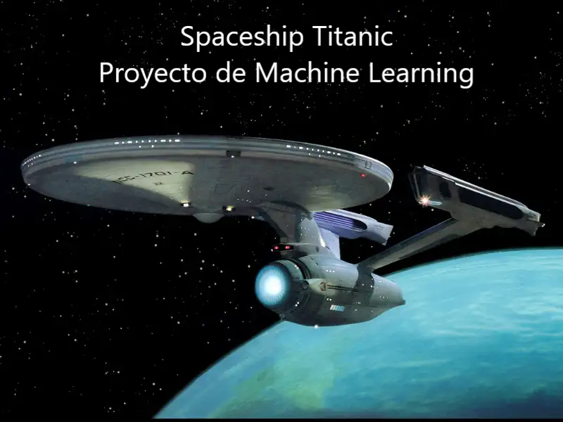

**Descripción**
-----------
El presente proyecto de machine learning tiene por objetivo predecir si un pasajero fue transportado a una dimensión alternativa durante la colisión de la nave espacial Titanic con la anomalía del espacio-tiempo. Para ayudarnos a hacer estas predicciones, se nos proporcionan un conjunto de registros personales recuperados del sistema informático dañado del la nave.

Se intentaron diferentes modelos de machine learning y diferentes aproximaciones para ingeniería de variables, que podrán consultar en los notebooks, para finalmente quedarnos con el modelo que mostraba las mejores métricas, el random Forest. El repo consta del procesamiento del dataset así como el entrenamiento de diferentes modelos. 

Se ha creado la soguiente estructura de carpetas para alojar los archivos que componen el trabajo:

**src**: carpeta raiz que contiene todo y dentro de la cual estan todas las subcarpetas del proyecto.
**src/data**: contiene todos mis achivos de datos. las fuentes de las que me he servido para poder hacer el trabajo. archivos.csv de train y test.

            **src/data/output**: Aqui estan alojados los CSV resultado de mis predicciones.
            **src/data/Processed**: Aqui estan alojados los CSV iniciales ya tratados. Sin valores nulos, eliminadas las columnas inncesarias...etc
            **src/data/Raw**: Aqui estan alojados los CSV iniciales descargados de la web de Kaggel.

    **src/notebook**: donde están alojados mis notebooks, osea, los ficheros de visual code con todo el código en lenguale Phython.
    **src/notebook/images**: donde he guardado las fotos con los graficos generados en los notebooks.
    **src/utils**: Archivo .Py con las funciones utulizadas en los notebooks.

**Datos**
-----------

El dataset contiene datos dristibuidos de la siguiente manera: 

- **PassengerId** : una identificación única para cada pasajero. Cada Id toma la forma gggg_pp donde gggg indica un grupo con el que viaja el pasajero y pp es su   número dentro del grupo. Las personas en un grupo a menudo son miembros de la familia, pero no siempre.
- **HomePlanet** : el planeta del que partió el pasajero, normalmente su planeta de residencia permanente.
- **CryoSleep** :  indica si el pasajero eligió ponerse en animación suspendida durante la duración del viaje. Los pasajeros en criosueño están confinados en sus   cabinas.
- **Cabin** : el número de cabina donde se hospeda el pasajero. Toma la forma cubierta/número/lado, donde lado puede ser P para babor o S para estribor.
- **Destination** : el planeta dónde desembarcará el pasajero.
- **Age** : la edad del pasajero.
- **VIP** : si el pasajero ha pagado por un servicio VIP especial durante el viaje.
- **RoomService, FoodCourt, ShoppingMall, Spa, VRDeck** monto que el pasajero ha facturado en cada uno de los muchos servicios de lujo del Spaceship df_train.
- **Name** : el nombre y apellido del pasajero.
- **Transported** : si el pasajero fue transportado a otra dimensión. Este es el objetivo, la columna que está tratando de predecir.

Como se ha tratado cada columna,elemenos nulos...etc esta detallado dentrod e cada notebookk. Hay 2 notebboks relativos a datos, el de train y el de test. El tratamoento es igual, aunque la diferencia entre el de train y el de test, es que en el dataframe de test, no tenemos la variable "Transported" (nuestro Target).

-----------
#### Fuentes de los Datos
* Web de Kaggel, https://www.kaggle.com/competitions/spaceship-titanic/overview

#### Autores
* Alberto Lázaro

